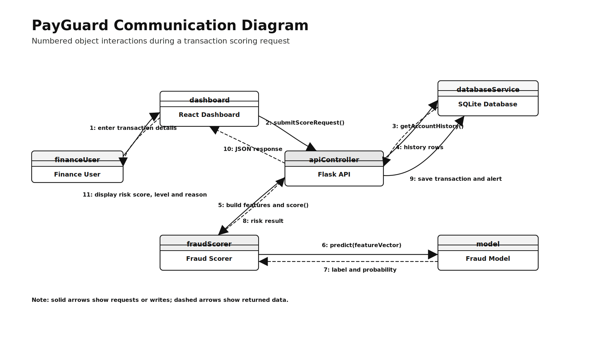

# PayGuard Rewrite Structure

Use this structure to rewrite the dissertation quickly. Follow the order below. Keep writing short, direct, and Word-style. Do not add extra sections unless the supervisor asks for them.

## Front Matter

1. Title Page
2. Declaration
3. Approval
4. Dedication
5. Acknowledgements
6. Abstract
7. Table of Contents
8. List of Tables
9. List of Figures

Use:

- `docs/table.md` for List of Tables.
- `docs/figures.md` for List of Figures.

---

# CHAPTER 1

## 1.0 Introduction

Briefly introduce PayGuard as a fraud detection and monitoring system for mobile money transactions.

## 1.1 Background to the Study

Explain the growth of mobile money, the risk of fraud, and the problem of manual fraud monitoring.

## 1.2 Statement of the Problem

Use bullet points. State the current system problems clearly:

- suspicious transactions are difficult to identify manually;
- review is slow;
- fraud patterns may be missed;
- transaction histories are not analysed automatically;
- reporting and dashboards are limited;
- there is no automated risk scoring support.

## 1.3 Objectives of the Study

1. To design and implement a PayGuard fraud detection system for mobile money transactions.
2. To improve fraud detection accuracy and speed using machine learning risk scoring.
3. To provide a dashboard for viewing transactions, alerts, risk levels, and account summaries.

## 1.5 Justification of the Research

Explain why the project matters to finance users, administrators, institutions, and researchers.

## 1.6 Assumptions of the Study

Keep this short:

- users will provide valid transaction data;
- synthetic data can represent common fraud patterns;
- basic computer infrastructure is available;
- users can be trained to use the dashboard.

## 1.4 Hypotheses

H0: A machine-learning-based fraud detection system does not improve fraud monitoring for mobile money transactions.

H1: A machine-learning-based fraud detection system improves fraud monitoring for mobile money transactions.

## 1.7 Delimitations of the Study

Limit the study to PayGuard as a prototype for synthetic mobile money transaction fraud detection and review.

## 1.8 Limitations of the Study

Mention:

- synthetic data instead of real banking data;
- time constraints;
- no real mobile money provider integration;
- no production authentication or role system.

## 1.9 Definition of Terms

Define:

- PayGuard
- Fraud detection
- Mobile money
- Machine learning
- Risk score
- Alert
- Synthetic data
- Dashboard

---

# CHAPTER 2

# LITERATURE REVIEW

## 2.0 Literature Review

Introduce the purpose of reviewing literature related to mobile money fraud, digital finance systems, and machine learning.

## 2.1 Introduction

Explain that the chapter reviews theory and empirical studies linked to the project objectives.

## 2.2 Theoretical Literature Review

### 2.2.1 Mobile Money Fraud and Transaction Monitoring Systems

Linked to Objective 1.

Discuss mobile money fraud, suspicious transactions, manual monitoring, and digital fraud monitoring systems.

### 2.2.2 Digital Financial Record and Dashboard Systems

Linked to Objectives 1 and 3.

Discuss dashboards, transaction records, alerts, and reporting.

### 2.2.3 Machine Learning in Fraud Detection

Linked to Objectives 2 and 3.

Discuss supervised learning, risk scoring, classification, and fraud pattern detection.

## 2.3 Empirical Literature Review

Review studies on fraud detection systems, machine learning fraud models, digital finance monitoring, and dashboard systems.

## 2.4 Summary, Research Gap, and Significance

### Research Gap

State that many systems either focus on general fraud detection or use real production data, while this project focuses on a simple academic prototype using synthetic mobile money data, Flask, SQLite, machine learning, and a dashboard.

### Significance of the Study

State significance to finance staff, administrators, students/researchers, and institutions.

---

# CHAPTER 3

# FEASIBILITY STUDY

## 3.0 Introduction

State that the chapter checks whether PayGuard is practical and achievable.

## 3.1 Economic Feasibility

Include:

- development cost;
- open-source tools;
- low hardware cost;
- reduced manual workload;
- faster fraud review.

Use table:

- Table: Estimated development cost.

## 3.2 Technical Feasibility

Mention:

- Python;
- Flask;
- SQLite;
- React/Vite;
- machine learning libraries;
- synthetic data generation.

Use table:

- Table: Software and hardware requirements.

## 3.3 Operational Feasibility

Explain how users can operate the dashboard, view alerts, score transactions, and search records.

## 3.4 Organizational Feasibility

Explain how PayGuard supports finance departments and fraud review work.

## 3.5 Schedule Feasibility

Include project phases and work plan.

Use figure:

## 3.6 Social Feasibility

Explain responsible use: alerts are warnings, not proof of fraud.

## 3.7 Conclusion

Conclude that PayGuard is feasible as an academic prototype.

---

# CHAPTER 4

# SYSTEM ANALYSIS

## 4.0 Introduction

Introduce current system analysis, requirements, and data flow.

## 4.1 Analysis of the Current System

Describe the current manual or semi-manual fraud monitoring process.

Use figure:

Use figure:

## 4.2 Functional Requirements

List:

- score transaction;
- create alert;
- view dashboard;
- view alerts;
- update alert status;
- view transactions;
- search account profile;
- view metrics.

Use table:

- Table: Functional requirements.

## 4.3 Non-Functional Requirements

List:

- usability;
- maintainability;
- reliability;
- performance;
- security;
- privacy;
- scalability.

Use table:

- Table: Non-functional requirements.

## 4.4 User and Operational Requirements

List users:

- finance officer;
- fraud analyst;
- administrator;
- researcher/developer.

Use figure:

Use figure:

## 4.4.1 Data Flow Diagram

Use figure:

Use figure:

## 4.5 Conclusion

Summarise the current system weakness and the proposed PayGuard requirements.

---

# CHAPTER V

# SYSTEM DESIGN

## 5.0 Introduction

Introduce design of the PayGuard prototype.

## 5.1 System Architecture Design

Explain frontend, backend, database, machine learning, and synthetic data generator.

### 5.1.1 System Architecture Diagram

Use figure:

### 5.1.2 Component Diagram

Use figure:

## 5.2 Input Design

Describe:

- transaction scoring form;
- account search;
- alert filters;
- transaction filters;
- synthetic data parameters.

Use table:

- Table: Main system inputs.

## 5.3 Process Design

Describe transaction scoring and alert review.

### 5.3.1 User Flow Flowchart

Use figure:

### 5.3.2 Sequence Diagram

Use figure:

Use figure:

## 5.4 Output Design

Describe:

- risk score;
- risk level;
- alert reason;
- dashboard metrics;
- alerts table;
- account summary.

Use table:

- Table: Main system outputs.

## 5.5 Database Design (Entity Structure)

Describe:

- transactions;
- alerts;
- model_runs;
- account profile as derived summary.

### 5.5.1 Entity Relationship Diagram

Use figure:

Use figure:

## 5.6 Security and Control Design

Include:

- input validation;
- database constraints;
- error handling;
- synthetic data;
- human review;
- future authentication.

## 5.7 Interface Design

Use figure:

Use figure:

Leave blank screenshot spaces:

**Figure: Dashboard screenshot**

**[SCREENSHOT SPACE - INSERT REAL DASHBOARD SCREENSHOT]**

**Figure: Alerts page screenshot**

**[SCREENSHOT SPACE - INSERT REAL ALERTS SCREENSHOT]**

**Figure: Transactions page screenshot**

**[SCREENSHOT SPACE - INSERT REAL TRANSACTIONS SCREENSHOT]**

**Figure: Account lookup screenshot**

**[SCREENSHOT SPACE - INSERT REAL ACCOUNT LOOKUP SCREENSHOT]**

## 5.8 Hardware and Software Platform

List:

- Windows development machine;
- Python;
- Flask;
- SQLite;
- React;
- Vite;
- Tailwind/shadcn;
- pandas, NumPy, scikit-learn, joblib.

## 5.9 Operational Design Considerations

Mention:

- local prototype;
- future hosting;
- backup;
- retraining;
- responsible fraud review.

## 5.10 Conclusion

Summarise design decisions.

---

# CHAPTER 6

# CODING AND TESTING

## 6.0 Introduction

Introduce implementation and testing.

## 6.1 Coding (Programming Phase)

Describe:

- backend coding;
- database coding;
- synthetic data generator;
- machine learning training;
- frontend dashboard.

Use figure:

Leave blank screenshot spaces:

**Figure: Project structure screenshot**

**[SCREENSHOT SPACE - INSERT REAL PROJECT STRUCTURE SCREENSHOT]**

**Figure: Backend scoring screenshot**

**[SCREENSHOT SPACE - INSERT REAL BACKEND/API SCREENSHOT]**

**Figure: Synthetic data generation screenshot**

**[SCREENSHOT SPACE - INSERT REAL TERMINAL SCREENSHOT]**

**Figure: Model training screenshot**

**[SCREENSHOT SPACE - INSERT REAL TERMINAL SCREENSHOT]**

## 6.2 Testing

Describe the testing approach.

## 6.3 Program Testing

Include:

- validation tests;
- API endpoint tests;
- feature engineering tests;
- model loading tests.

Use table:

- Table: Program test cases.

## 6.4 System Testing

Include:

- frontend-backend integration;
- scoring workflow;
- dashboard metrics;
- transaction storage;
- alert creation.

Leave blank screenshot space:

**Figure: End-to-end demonstration screenshot**

**[SCREENSHOT SPACE - INSERT REAL END-TO-END SCREENSHOT]**

## 6.5 User Acceptance Testing

State that users check whether dashboard screens are understandable and useful.

Use table:

- Table: User acceptance testing summary.

## 6.6 Conclusion

Summarise coding and testing results.

---

# CHAPTER 7

# IMPLEMENTATION AND MAINTENANCE

## 7.0 Introduction

Introduce installation, changeover, documentation, and maintenance.

## 7.1 System Implementation

Describe local implementation of PayGuard.

### 7.1.1 Acquisition and Installation

Include:

- install backend dependencies;
- install frontend dependencies;
- generate data;
- train model;
- seed database;
- start Flask backend;
- start React frontend.

Leave blank screenshot spaces:

**Figure: Backend setup screenshot**

**[SCREENSHOT SPACE - INSERT REAL BACKEND SETUP SCREENSHOT]**

**Figure: Frontend setup screenshot**

**[SCREENSHOT SPACE - INSERT REAL FRONTEND SETUP SCREENSHOT]**

### 7.1.2 Data Conversion

Explain conversion from generated CSV to SQLite records.

Leave blank screenshot space:

**Figure: Data preparation screenshot**

**[SCREENSHOT SPACE - INSERT REAL DATA PREPARATION SCREENSHOT]**

### 7.1.3 User Training

Explain how users learn dashboard, alerts, transactions, accounts, and responsible use.

Leave blank screenshot space:

**Figure: User training screenshot**

**[SCREENSHOT SPACE - INSERT REAL USER TRAINING SCREENSHOT]**

## 7.2 Changeover Strategy

State that parallel changeover is recommended for future real deployment.

## 7.3 Documentation

### 7.3.1 User Documentation

Mention user guide for dashboard, scoring, alerts, transactions, and accounts.

### 7.3.2 System Documentation

Mention backend, frontend, database, model, and setup documentation.

## 7.4 Maintenance and Post-Implementation Plan

Include:

- database backup;
- model retraining;
- dependency updates;
- bug fixing;
- alert threshold review;
- future security improvements.

Use figure:

Use table:

- Table: Maintenance activities.

## 7.5 Conclusion

Summarise implementation and maintenance plan.

---

# CHAPTER 8

# SUMMARY, CONCLUSIONS AND RECOMMENDATIONS

## 8.0 Introduction

Introduce final chapter.

## 8.1 Summary of the Study

Summarise the problem, proposed system, implementation, and testing.

## 8.2 Summary of Major Findings

Mention:

- manual fraud review is slow;
- machine learning can support risk scoring;
- dashboard improves visibility;
- alerts support human review;
- synthetic data made prototype development possible.

## 8.3 Significance of the Findings

Explain significance to finance users, administrators, researchers, and institutions.

## 8.4 Conclusions

Conclude that PayGuard achieved the main prototype goals.

## 8.5 Recommendations

### 8.5.1 Recommendations from the Research Findings

Recommend using PayGuard-style dashboards for fraud review support.

### 8.5.2 Recommendations for Further Research

Recommend:

- real-world data evaluation;
- stronger models;
- role-based authentication;
- provider integration;
- audit logs.

### 8.5.3 Recommendations for Practice and Policy

Recommend human review, privacy controls, and responsible use of fraud predictions.

## 8.6 Final Statement

Close with one short paragraph stating that PayGuard demonstrates how a simple AI-supported fraud monitoring prototype can improve transaction review.

---

# References

Use only sources cited in the rewritten document.

---

# Appendices

Appendix A: Questionnaire or interview guide if used.

Appendix B: Sample screenshots.

Appendix C: Code snippets or setup commands.

Appendix D: Test cases.

